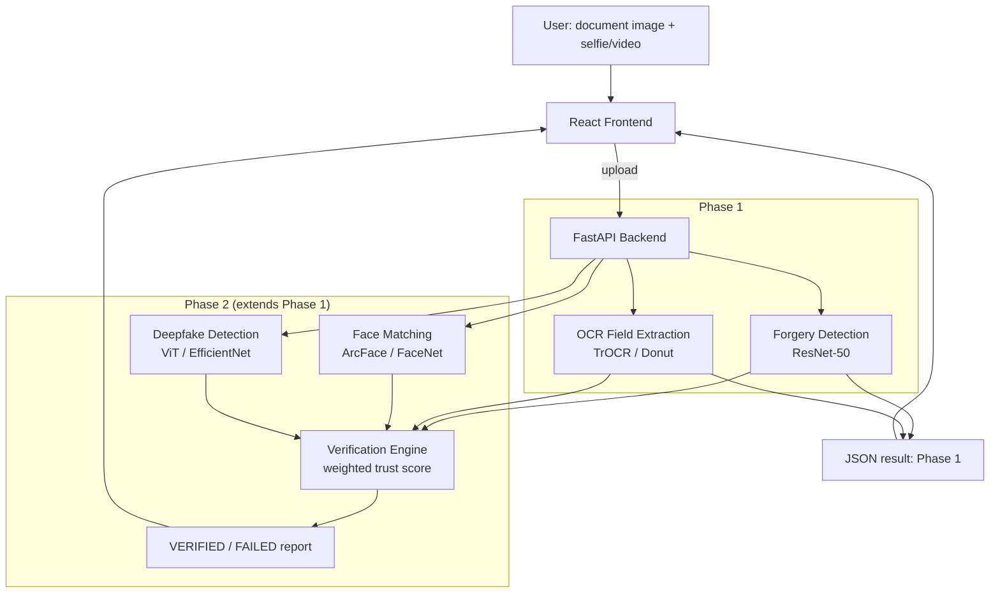

# AI Identity Shield

A multi-modal identity verification pipeline: document forgery detection, OCR
field extraction, face matching, and deepfake/liveness detection combined into
a single verification report. Portfolio project - not for production/real
identity verification use.

## Status

**Phase 1 (MVP): in progress.**

| # | Component | Status |
|---|-----------|--------|
| 1 | Document forgery detection (ResNet-50 + Grad-CAM) | in progress |
| 2 | OCR field extraction (TrOCR/Donut) | not started |
| 3 | FastAPI backend | not started |
| 4 | React frontend (verification report card) | not started |
| 5 | Face matching (ArcFace/FaceNet, Phase 2) | not started |
| 6 | Deepfake detection (ViT/EfficientNet, Phase 2) | not started |
| 7 | Weighted trust-score verification engine (Phase 2) | not started |
| 8 | Frontend multi-signal report (Phase 2) | not started |

## Architecture



## Datasets

None of these are stored in this repo. Each is downloaded on demand by a
script in `scripts/` or a notebook cell in `notebooks/`.

| Dataset | Used for | License / access |
|---|---|---|
| [MIDV-2020 (Roboflow Universe)](https://universe.roboflow.com/shriya-shetty-peuyp/midv-2020-mrp-s7pj8) | Forgery detection (authentic samples + synthetic tampering), OCR field crops | CC BY 4.0, free |
| [FUNSD](https://guillaumejaume.github.io/FUNSD/) | General form-field understanding reference for OCR | Research/non-commercial use, free |
| [LFW (Labeled Faces in the Wild)](https://vis-www.cs.umass.edu/lfw/) | Face-matching evaluation benchmark | Free for research use |
| [FaceForensics++](https://github.com/ondyari/FaceForensics) | Deepfake detection training (Phase 2) | Free, requires academic-use request form |
| [Celeb-DF](https://github.com/yuezunli/celeb-deepfakeforensics) | Deepfake detection training, alternative to FF++ (Phase 2) | Free, requires access request |

Synthetic tampered documents (splice / copy-paste / photo-swap) are generated
programmatically from MIDV-2020 authentic images - no separate download.

FaceForensics++/Celeb-DF require filling a short access-request form before
they can be downloaded; see [`scripts/deepfake_dataset_access.md`](scripts/deepfake_dataset_access.md)
for instructions. Not needed until Phase 2.

## Setup

```bash
# 1. Clone and create a virtual environment
python -m venv venv
venv\Scripts\activate        # Windows
# source venv/bin/activate   # macOS/Linux

pip install -r requirements.txt

# 2. Configure secrets
copy .env.example .env        # Windows
# cp .env.example .env        # macOS/Linux
# then edit .env and set ROBOFLOW_API_KEY (free key from https://app.roboflow.com/settings/api)

# 3. Download datasets
python scripts/download_midv2020.py
python scripts/download_funsd.py
python scripts/download_lfw.py
```

All dataset/model paths are relative and configurable via `.env` - no
hardcoded local paths, personal drive links, or API keys anywhere in the repo.

## Running (Phase 1)

```bash
# Train the forgery detector (see notebooks/01_document_forgery_detection.ipynb
# for the Colab-compatible walkthrough with eval + Grad-CAM)
python -m src.forgery_detection.train

# Backend
uvicorn backend.app.main:app --reload

# Frontend
cd frontend
npm install
npm run dev
```

## Repo layout

```
data/            downloaded datasets (gitignored)
models/          trained checkpoints (gitignored)
notebooks/       Colab-compatible training/eval notebooks, one per module
scripts/         standalone dataset download scripts
src/             training + inference code, importable by notebooks & backend
backend/         FastAPI app
frontend/        React app
```
