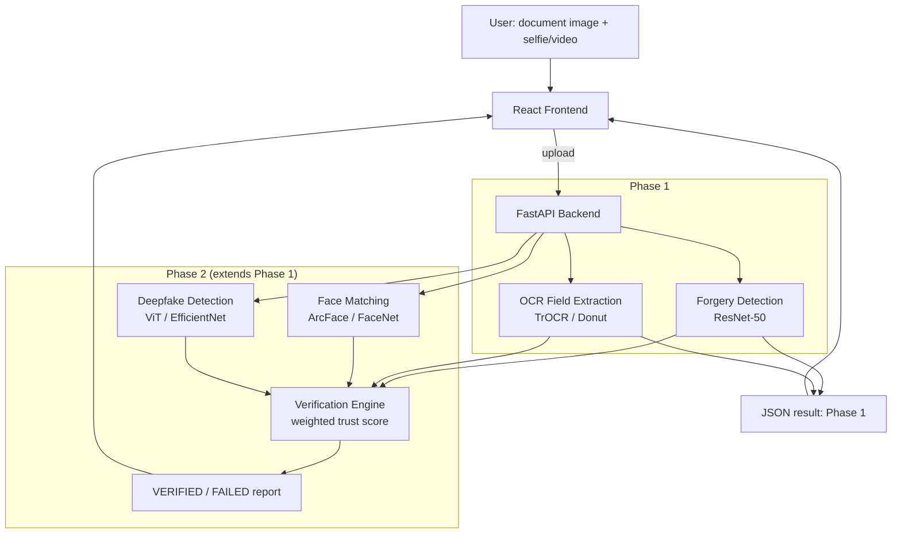

# AI Identity Shield

A multi-modal identity verification pipeline: document forgery detection, OCR
field extraction, face matching, and deepfake/liveness detection combined into
a single verification report. Portfolio project - not for production/real
identity verification use.

## Status

**Phase 1 (MVP): in progress.**

| # | Component | Status |
|---|-----------|--------|
| 1 | Document forgery detection (ResNet-50 + Grad-CAM) | in progress |
| 2 | OCR field extraction (TrOCR/Donut) | not started |
| 3 | FastAPI backend | not started |
| 4 | React frontend (verification report card) | not started |
| 5 | Face matching (ArcFace/FaceNet, Phase 2) | not started |
| 6 | Deepfake detection (ViT/EfficientNet, Phase 2) | not started |
| 7 | Weighted trust-score verification engine (Phase 2) | not started |
| 8 | Frontend multi-signal report (Phase 2) | not started |

## Architecture



## Datasets

None of these are stored in this repo. Each is downloaded on demand by a
script in `scripts/` or a notebook cell in `notebooks/`.

| Dataset | Used for | License / access |
|---|---|---|
| [MIDV-2020 (Roboflow Universe)](https://universe.roboflow.com/shriya-shetty-peuyp/midv-2020-mrp-s7pj8) | Forgery detection (authentic samples + synthetic tampering), OCR field crops | CC BY 4.0, free |
| [FUNSD](https://guillaumejaume.github.io/FUNSD/) | General form-field understanding reference for OCR | Research/non-commercial use, free |
| [LFW (Labeled Faces in the Wild)](https://vis-www.cs.umass.edu/lfw/) | Face-matching evaluation benchmark | Free for research use |
| [FaceForensics++](https://github.com/ondyari/FaceForensics) | Deepfake detection training (Phase 2) | Free, requires academic-use request form |
| [Celeb-DF](https://github.com/yuezunli/celeb-deepfakeforensics) | Deepfake detection training, alternative to FF++ (Phase 2) | Free, requires access request |

Synthetic tampered documents (splice / copy-paste / photo-swap) are generated
programmatically from MIDV-2020 authentic images - no separate download.

FaceForensics++/Celeb-DF require filling a short access-request form before
they can be downloaded; see [`scripts/deepfake_dataset_access.md`](scripts/deepfake_dataset_access.md)
for instructions. Not needed until Phase 2.

## Setup

```bash
# 1. Clone and create a virtual environment
python -m venv venv
venv\Scripts\activate        # Windows
# source venv/bin/activate   # macOS/Linux

pip install -r requirements.txt

# 2. Configure secrets
copy .env.example .env        # Windows
# cp .env.example .env        # macOS/Linux
# then edit .env and set ROBOFLOW_API_KEY (free key from https://app.roboflow.com/settings/api)

# 3. Download datasets
python scripts/download_midv2020.py
python scripts/download_funsd.py
python scripts/download_lfw.py
```

All dataset/model paths are relative and configurable via `.env` - no
hardcoded local paths, personal drive links, or API keys anywhere in the repo.

## Running (Phase 1)

```bash
# Train the forgery detector (see notebooks/01_document_forgery_detection.ipynb
# for the Colab-compatible walkthrough with eval + Grad-CAM)
python -m src.forgery_detection.train

# Backend
uvicorn backend.app.main:app --reload

# Frontend
cd frontend
npm install
npm run dev
```

## Repo layout

```
data/            downloaded datasets (gitignored)
models/          trained checkpoints (gitignored)
notebooks/       Colab-compatible training/eval notebooks, one per module
scripts/         standalone dataset download scripts
src/             training + inference code, importable by notebooks & backend
backend/         FastAPI app
frontend/        React app
```

## Team Contributions

Work is split into three vertical ownership tracks — computer-vision forensics, OCR/data engineering, and system integration — sized so each person carries a comparable mix of research effort, implementation effort, and debugging effort rather than an equal file count.

| Team Member | Responsibilities |
|---|---|
| **Shriya Shetty** | **Document Forgery Detection & Visual Forensics (Computer Vision core)**<br>• ResNet-50 tamper classifier: architecture, training loop, checkpoints (`src/forgery_detection/model.py`, `train.py`)<br>• Error Level Analysis forensic preprocessing (`forensics.py`) and copy-move/clone detection (`copy_move.py`)<br>• Synthetic tampering generator used to create labeled forged samples from authentic MIDV-2020 scans (`scripts/generate_synthetic_tampering.py`, `generate_forgery_crops.py`)<br>• Crop-based region inference — the approach that replaced five failed whole-image classification attempts and got the model to 100% precision / 21.5% recall (`region_inference.py`, `inference.py`)<br>• Grad-CAM explainability overlays for tamper localization (`gradcam.py`) and quantitative eval (`evaluate.py`, confusion matrix, `outputs/gradcam/*`)<br>• Colab training/eval walkthrough (`notebooks/01_document_forgery_detection.ipynb`)<br>• **Phase 2:** Deepfake/liveness detection (ViT/EfficientNet on FaceForensics++/Celeb-DF)<br>• Wires the forgery branch into `backend/app/pipeline.py::run_forgery_detection`<br>• Unit tests: `test_copy_move.py`, `test_tampering.py`; module docs for the forensics pipeline |
| **Arjun B Shetty** | **OCR Field Extraction, Field Localization & Data Engineering**<br>• Field-detector model that both OCR and the forgery cropper depend on: architecture, training, eval (`src/field_detection/model.py`, `train.py`, `evaluate.py`, `dataset.py`)<br>• OCR field extraction with detector-driven and Donut fallback extractors (`src/ocr/extract.py`) and field-level validation/regex/fuzzy-match rules (`src/ocr/validate.py`) — current accuracy: name ~80%, DOB 100%, overall doc ~73%<br>• Dataset acquisition and COCO-format annotation tooling (`src/common/coco_utils.py`, `scripts/download_midv2020.py`, `download_funsd.py`, `download_lfw.py`)<br>• OCR accuracy benchmarking harness (`scripts/evaluate_ocr.py`)<br>• **Phase 2:** Face matching (ArcFace/FaceNet) using the already-provisioned LFW pipeline<br>• Wires the OCR/field branch into `backend/app/pipeline.py::run_ocr`<br>• Unit tests: `test_coco_utils.py`, `test_validate.py`; dataset/license documentation (`scripts/deepfake_dataset_access.md`, Datasets table) |
| **Khushi** | **System Integration, Backend/Frontend Architecture & Verification Engine**<br>• FastAPI service: request/response schemas, upload handling, startup model loading (`backend/app/main.py`, `schemas.py`)<br>• `VerificationPipeline` orchestration layer that composes the forgery + OCR branches into one report and status decision (`backend/app/pipeline.py`)<br>• React frontend: upload flow, API client, verification report UI (`frontend/src/App.jsx`, `api.js`, `components/UploadForm.jsx`, `components/VerificationReport.jsx`)<br>• **Phase 2:** Weighted trust-score verification engine that fuses forgery + OCR + face + deepfake signals into VERIFIED/FLAGGED/FAILED, and the multi-signal frontend report<br>• Environment/config and reproducibility: `.env.example`, `requirements.txt`, `pytest.ini`, dataset/model path config (`src/common/config.py`)<br>• End-to-end/API integration testing across all three modules’ outputs<br>• Owns architecture diagram, setup/run instructions, and overall README maintenance |

## Shared Responsibilities

- Project planning and Phase 1/Phase 2 scope decisions
- Architecture design (pipeline diagram, model interfaces, API contracts between modules)
- Final integration of all three tracks into a single verification report
- Cross-review of each other's code (forensics ↔ OCR ↔ backend/frontend)
- Final end-to-end testing before each milestone
- Documentation review (README, notebooks, dataset access notes)
- Presentation / demo preparation
